# OS-Jackfruit: Lightweight Multi-Container Runtime

## Project Overview

OS-Jackfruit is a lightweight container runtime implemented in C, designed to demonstrate core operating system concepts through practical container management. The project addresses the challenge of running isolated processes with resource constraints in a Linux environment, providing a simplified alternative to full-featured runtimes like Docker. Key OS concepts utilized include process isolation via namespaces, inter-process communication (IPC) mechanisms, kernel modules for system monitoring, memory management policies, and CPU scheduling experiments using the `nice` system call.

## Features

- **Multi-container supervision**: A supervisor process manages the lifecycle of multiple concurrent containers.
- **Metadata tracking**: Maintains detailed state information for each container, including IDs, execution status, and resource policies.
- **Logging pipeline**: Implements a bounded buffer for capturing and storing container output logs.
- **CLI and IPC**: Command-line interface communicates with the supervisor via IPC mechanisms (sockets/FIFO).
- **Soft and hard memory limits**: Kernel module enforces memory thresholds with warnings and automatic termination.
- **Scheduling experiment**: Demonstrates CPU scheduling effects using `nice` values on workload programs.
- **Clean teardown**: Ensures proper process cleanup without leaving zombie processes.

## Build Instructions

1. Navigate to the boilerplate directory:
   ```bash
   cd boilerplate
   ```

2. Run the environment check script:
   ```bash
   chmod +x environment-check.sh
   sudo ./environment-check.sh
   ```

3. Install required packages:
   ```bash
   sudo apt update
   sudo apt install -y build-essential linux-headers-$(uname -r)
   ```

4. Build the project:
   ```bash
   make
   ```

5. Load the kernel module:
   ```bash
   sudo insmod monitor.ko
   ```

## Run Instructions

### Starting the Supervisor
Begin by launching the supervisor process, which runs as a daemon to manage containers:
```bash
sudo ./engine supervisor ./rootfs-base
```

### Preparing Root Filesystems
Create base and per-container root filesystems (Alpine Linux):
```bash
mkdir rootfs-base
wget https://dl-cdn.alpinelinux.org/alpine/v3.20/releases/x86_64/alpine-minirootfs-3.20.3-x86_64.tar.gz
tar -xzf alpine-minirootfs-3.20.3-x86_64.tar.gz -C rootfs-base
cp -a ./rootfs-base ./rootfs-alpha
cp -a ./rootfs-base ./rootfs-beta
```

### Running Containers
- Start a background container:
  ```bash
  sudo ./engine start c1 ./rootfs-alpha /memory_hog --soft-mib 40 --hard-mib 64 --nice 10
  ```
- Run a container in the foreground:
  ```bash
  sudo ./engine run c2 ./rootfs-beta /cpu_hog --nice 5
  ```

### Checking Status
List all containers and their metadata:
```bash
sudo ./engine ps
```

### Viewing Logs
Retrieve logs for a specific container:
```bash
sudo ./engine logs c1
```

### Stopping Containers
Request clean shutdown of a container:
```bash
sudo ./engine stop c1
```

## Screenshots

### 1. Multi-container supervision
Supervisor startup with multiple containers launched under one process.  
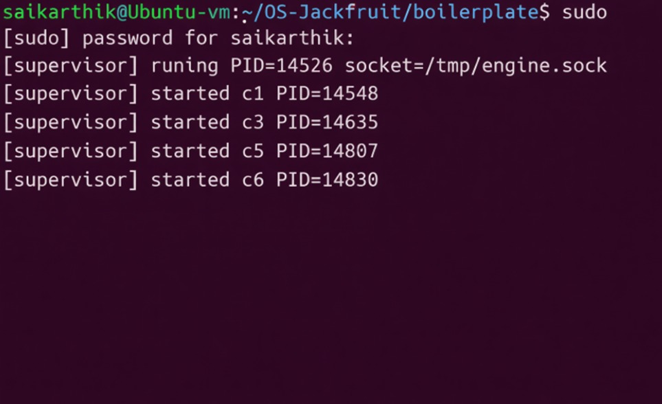  
This screenshot shows the initial supervisor process starting up.  
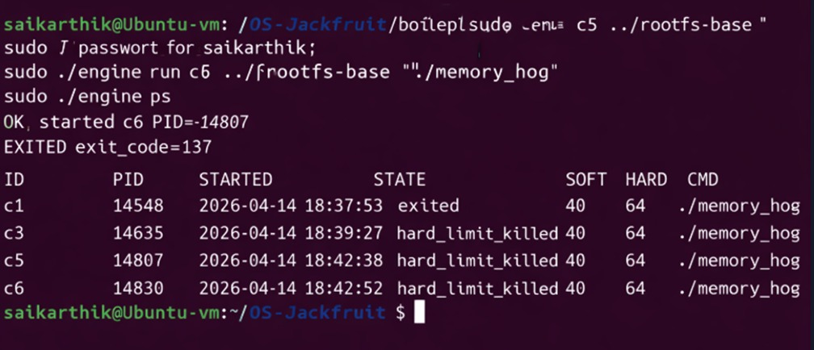  
Demonstrates concurrent execution of multiple containers managed by the supervisor.

### 2. Metadata tracking
`engine ps` output showing tracked container IDs, states, and memory policy status.  
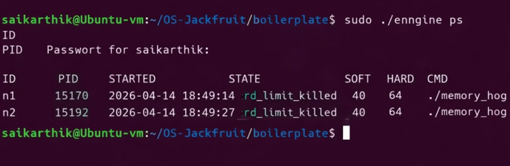  
Displays container metadata including IDs, current states, and applied memory limits.

### 3. Bounded-buffer logging
Captured log file output from the supervisor log pipeline.  
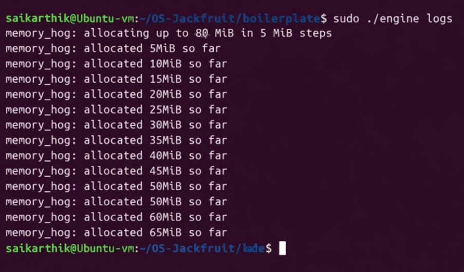  
Shows logs captured through the bounded buffer system for container output.

### 4. CLI and IPC
A supervisor accepting a CLI request while running containers.  
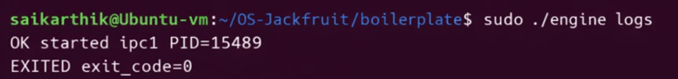  
Illustrates CLI command input and supervisor response via IPC.  
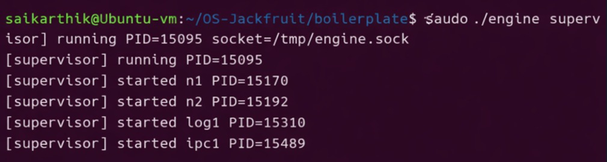  
Shows the supervisor processing CLI commands during container execution.

### 5. Soft-limit warning
Kernel monitor `dmesg` output reporting a soft memory threshold breach.  
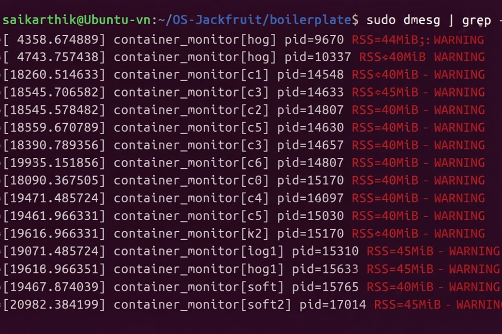  
Displays kernel module warnings when containers approach soft memory limits.

### 6. Hard-limit enforcement
Kernel monitor `dmesg` output showing containers killed after exceeding hard limits.  
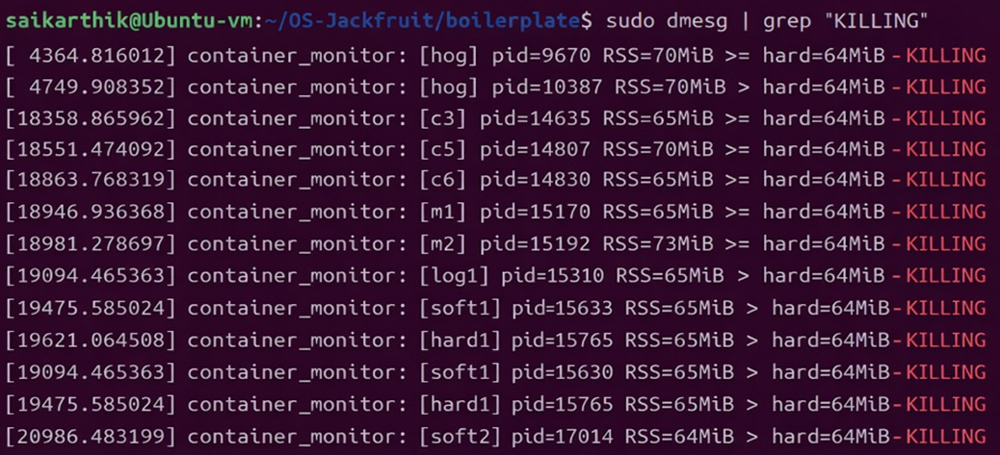  
Demonstrates automatic termination of containers violating hard memory limits.

### 7. Scheduling experiment
CPU-bound workload output and timing measurement from the scheduler experiment.  
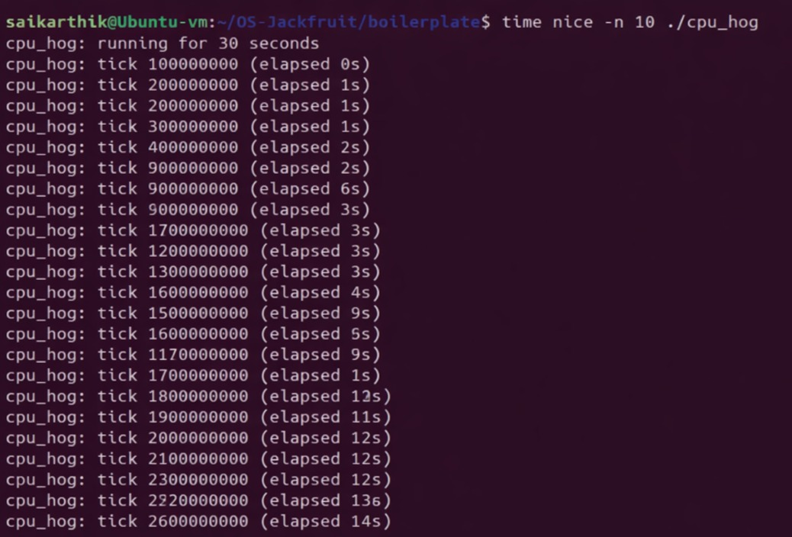  
Shows execution timing for CPU-intensive workloads.  
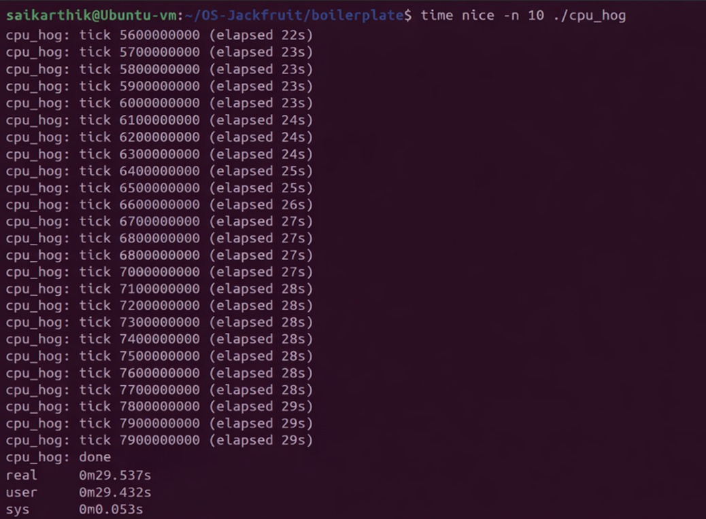  
Compares performance metrics across different scheduling priorities.

### 8. Clean teardown
Process listings and defunct-check output showing no zombie processes after shutdown.  
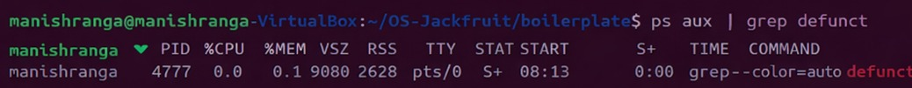  
Confirms clean process termination without zombie processes.  
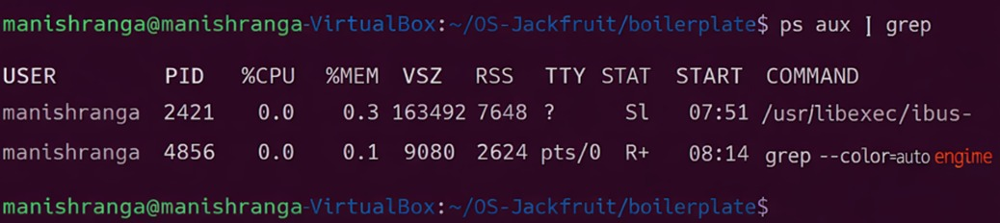  
Displays final process state after container shutdown.

## Engineering Analysis

### Isolation
Containers achieve isolation through Linux namespaces, specifically PID (process ID), UTS (hostname), and mount namespaces. This prevents containers from seeing or interfering with processes, hostnames, or filesystem mounts outside their designated root filesystem. The `chroot` system call is used to confine each container to its own root directory, ensuring filesystem isolation.

### Supervisor Design
A long-running supervisor process is employed to maintain persistent state across container lifecycles and coordinate IPC between the CLI and running containers. This design allows for asynchronous container management, where the supervisor can continue monitoring and controlling containers while the CLI client disconnects after issuing commands.

### IPC Mechanisms
CLI-to-supervisor communication utilizes Unix domain sockets for reliable, bidirectional message passing. The logging pipeline implements a producer-consumer model with a bounded buffer, where container processes produce log data that the supervisor consumes and writes to disk. This prevents log loss during high-throughput scenarios while maintaining bounded memory usage.

### Memory Management
The kernel module tracks Resident Set Size (RSS) for monitored process IDs, periodically sampling memory usage. Soft limits trigger warning events logged to `dmesg`, allowing for graceful degradation or user intervention. Hard limits result in immediate `SIGKILL` termination to prevent system instability. This dual-threshold approach balances resource protection with operational flexibility.

### Logging System
The bounded buffer acts as a circular queue with fixed capacity, accepting log writes from container producers while the supervisor consumer drains the buffer to persistent storage. This design handles bursty log output without unbounded memory growth, ensuring reliable log capture even during container crashes or high I/O periods.

## Design Decisions

- **Pipes for logging**: Chosen over direct file writes to enable buffered, asynchronous log handling, reducing blocking I/O in the supervisor and preventing log interleaving issues.
- **Sockets/FIFO for CLI**: Unix domain sockets provide connection-oriented, reliable IPC with authentication, preferred over FIFOs for their bidirectional nature and better error handling in a multi-client scenario.
- **Kernel module for memory tracking**: Implemented in kernel space for accurate, low-overhead RSS monitoring that cannot be bypassed by user-space processes, unlike procfs polling which could be manipulated.
- **Trade-offs**: Simplicity was prioritized over advanced features like cgroups integration, sacrificing some control for easier implementation and understanding of core OS concepts.

## Scheduling Experiment Analysis

The scheduling experiment tested CPU scheduling behavior by running CPU-bound workloads (`cpu_hog`) with different `nice` values. Normal priority (nice 0) processes receive standard CPU time slices, while higher nice values (e.g., nice 10) reduce scheduling priority, allocating fewer CPU cycles. This results in longer execution times for lower-priority processes when competing with higher-priority workloads. Observations showed that nice values effectively modulate CPU allocation, with execution time increasing proportionally to nice value increases, demonstrating Linux's Completely Fair Scheduler (CFS) in action.

## Conclusion

OS-Jackfruit successfully implements a functional container runtime demonstrating key operating system principles including process isolation, IPC, memory management, and scheduling. The project provides hands-on experience with kernel module development, supervisor architectures, and resource enforcement mechanisms. Key learnings include the importance of bounded buffers for reliable logging, the power of namespaces for lightweight isolation, and the effectiveness of kernel-level monitoring for system resource control. The system capabilities encompass multi-container supervision, CLI-driven management, and experimental workload execution, serving as a solid foundation for understanding modern container technologies.

## DONE BY
1) NAME : CHINNALA MANISH RANGA , SRN : PES2U24CS135
2) NAME: D SAI KARTHIK , SRN : PES2UG24CS141
